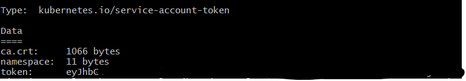
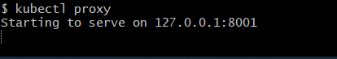
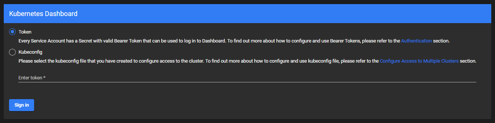
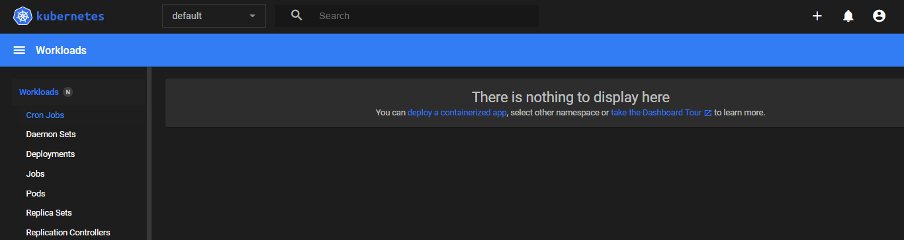

## K8 Web UI

### Introduction
- The K8 web UI will show the details of the pods and deployment of the kubernetes that are up and running.
- Web UI dashboard provides a user interface to view kubernetes resource.

### Steps to enable web UI
[Source: Kubernetes docs](https://kubernetes.io/docs/tasks/access-application-cluster/web-ui-dashboard/)

#### Step 1: Make Sure your Kubernetes is running
- Running the below command should return you a cluster IP and the service that is running in the localhost
```
 kubectl get all
```
#### Step 2: Deploying the dashboard UI

- Deploy the dashboard UI as it is not downloaded by default.
- Run the below command

```
kubectl apply -f https://raw.githubusercontent.com/kubernetes/dashboard/v2.5.0/aio/deploy/recommended.yaml
```

- Below id the sample output that you will see on successful deployment of the dashboard


#### Step 3: Get the accounts
- To create hte proxy we have to create the an account token, which will be available in the kube-system.
- To get the accounts we can use the below command
```
kubectl describe secret -n kube-system
```
- Now copy the token that is showed under type "kubernetes.io/service-account-token" and run below command


```
kubectl proxy 
```


#### Step 4: Login to the dashboard
- Now go to the [URL to login](http://localhost:8001/api/v1/namespaces/kubernetes-dashboard/services/https:kubernetes-dashboard:/proxy/) and you will see something like below



- Now select the "Token" option and paste the token that we have copied in step 3 and click "Sign In"]
- You should be able to see the dashboard now

