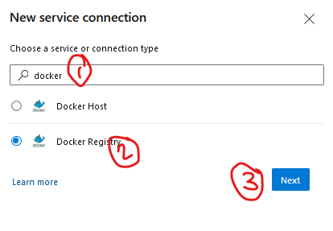

## Create a CI pipeline to push the docker image into ACR

### Pre-requisites:
- To tirgger the CI and CD from the Azure DevOps pipeline we need to have an ACR and AKS cluster to be deployed on.
- To build the AKS cluster and ACR we can use the terraform files [here](../ACR%20and%20AKS%20-%20Terraform/)

### Create the service connection to ACR


### YML for CI
- yaml manifest for the netcore app build and ACR push

```
# Starter pipeline
# Start with a minimal pipeline that you can customize to build and deploy your code.
# Add steps that build, run tests, deploy, and more:
# https://aka.ms/yaml

trigger:
- master

variables:
- name: BuildParameters.RestoreBuildProjects
  value: '**/*.csproj'
- name: BuildPlatform
  value: 'any cpu'
- name: BuildConfiguration
  value: 'Release'
name: $(date:yyyyMMdd)$(rev:.r)

stages:
- stage: "Build_net_core_application"
  jobs:
  - job:
    steps:
    - checkout: self
    - task: DotNetCoreCLI@2
      displayName: Restore dependencies
      inputs:
        command: restore
        projects: $(BuildParameters.RestoreBuildProjects)

    - task: DotNetCoreCLI@2
      displayName: Build net core app
      inputs:
        command: build
        projects: $(BuildParameters.RestoreBuildProjects)
        arguments: --configuration $(BuildConfiguration)

- stage: Build_andpush_docker_image
  jobs:
  - job: "Build_and_Push_ACR_Image"
    steps:
    - checkout: self
    - task: Docker@2
      displayName: "build and push ACR Image"
      inputs:
        containerRegistry: 'service_connection_acr'
        repository: 'mediawiki_app'
        command: 'buildAndPush'
        Dockerfile: '**/Dockerfile'
        tags: 
          $(Build.SourceVersion)
    - task: CopyFiles@2
      displayName: "copy files"
      inputs:
        SourceFolder: '$(System.DefaultWorkingDirectory)/kube-manifest'
        Contents: '**'
        TargetFolder: '$(Build.ArtifactStagingDirectory)'
        OverWrite: true
    - task: PublishBuildArtifacts@1
      displayName: "Pushing the Kube manifest as artifact"
      inputs:
        PathtoPublish: '$(Build.ArtifactStagingDirectory)'
        ArtifactName: 'drop'
        publishLocation: 'Container'
```
- The build will be publishing the artifact with kube-manifest yaml file which will be consumed in the release pipeline